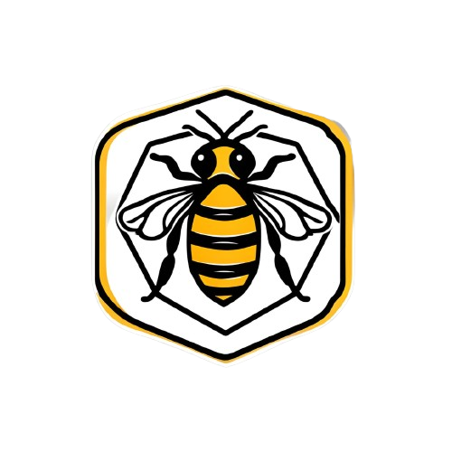

<h1 align="center">
  
</h1>
<h1 align="center">Nativas</h1>
<p align="center"> 🍯 Website de um criador de abelhas nativas Institucinal / E-coomerce / Paginas de Vendas</p>

<p align="center">
  

  

  <a href="https://github.com/tgmarinho/README-ecoleta/commits/master">
    
  </a>
    
   
   <a href="https://github.com/saviovitoralves/nativas/stargazers">
    
  </a>
  
</p>

<h4 align="center"> 
	🚧  Nativas 🚀 Pre Finalizado...  🚧
</h4>

## 💻 Sobre o projeto

🍯 Nativas - é uma forma de facilitar a venda conectando pessoas aos produtos oriundos abelhas nativas (sem ferrão) de maneira facil e pratica.


Projeto desenvolvido no perodo de 15 dias no mes de julho de 2024, com intuito de estudar e treinar a tecnologia do react js e suas libs.
O Website Nativas foi desenvolvido para oferecer uma experiência de compra prática, segura e agradável, além de fornecer informações detalhadas sobre nossa história, valores e compromisso com a qualidade.

---

## ⚙️ Funcionalidades

- [x] Clientes podem realizar compras e aconpanhar seus pedidos
- [x] Os usuários tem acesso ao aplicativo móvel, onde podem:
  - [x] verificar a localidade do seu pedio em tempo real 
  - [x] Fazer novos pedios

---

### Processo
- [x] Criação do prototipo
- [x] Esqueto basico
- [x] Area de produtos
- [x] Pagina de vendas
- [ ] Pagina de envio
- [ ] Conecção com API
- [ ] Banco de Dados

### Pré-requisitos

Antes de começar, você vai precisar ter instalado em sua máquina as seguintes ferramentas:
[Git](https://git-scm.com), [Node.js](https://nodejs.org/en/). 
Além disto é bom ter um editor para trabalhar com o código como [VSCode](https://code.visualstudio.com/)

### 🎲 Rodando o Back End (servidor)

```bash
# Clone este repositório
$ git clone <https://github.com/tgmarinho/nlw1>

# Acesse a pasta do projeto no terminal/cmd
$ cd nlw1

# Vá para a pasta server
$ cd server

# Instale as dependências
$ npm install

# Execute a aplicação em modo de desenvolvimento
$ npm run dev:server

# O servidor inciará na porta:3333 - acesse <http://localhost:3333>
```

### 🛠 Tecnologias

As seguintes ferramentas foram usadas na construção do projeto:

- [Javascrip](https://developer.mozilla.org/pt-BR/docs/Web/JavaScript)
- [Node.js](https://nodejs.org/en/)
- [React](https://pt-br.reactjs.org/)
- [React Slick](https://react-slick.neostack.com/)
- [Bootstrap](https://getbootstrap.com/)
- ### Autor
---

<a href="https://blog.rocketseat.com.br/author/thiago/">
 
 <br />
 <sub><b>Savio Vitor</b></sub></a> <a href="https://blog.rocketseat.com.br/author/thiago//" title="Rocketseat">🚀</a>


Feito com ❤️ por Savio Vitor 👋🏽 Entre em contato!

[](https://instagram.com/saviovitoralves) [](https://www.linkedin.com/in/saviovitoralves/) 
[](mailto:saviovitor2@gmail.com)


---

## 📝 Licença

Este projeto esta sobe a licença [MIT](./LICENSE).

Feito com ❤️ por Savio Viotr 👋🏽 [Entre em contato!](https://www.linkedin.com/in/saviovioralves/)

---
